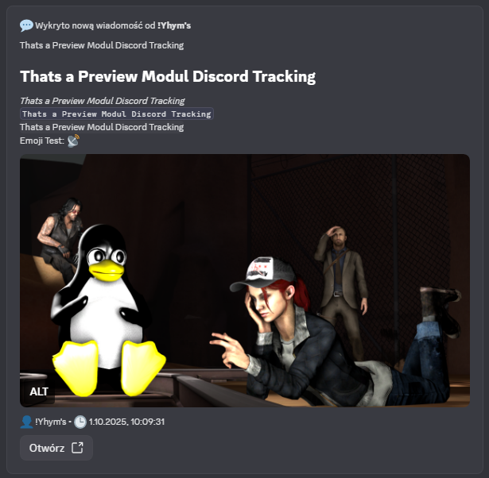
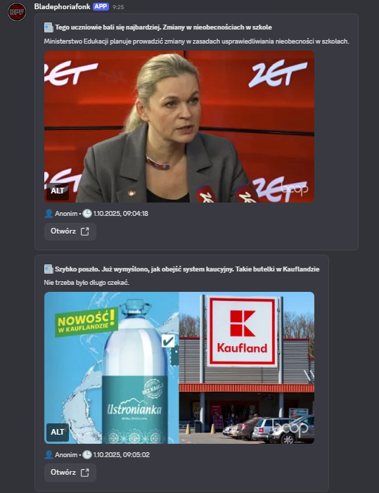
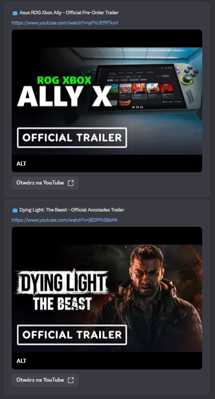

# 📡 XFeeder

> Modular RSS/Atom/JSON feed reader for Discord webhooks with extensible plugin system.

[](https://nodejs.org/)
[](https://git.marmak.net.pl/yhymid/XFeeder)
[](LICENSE)



## ✨ Features

- 📰 **Multi-format Support** — RSS 2.0, Atom, JSON Feed, custom APIs
- 🎬 **YouTube Integration** — Dedicated parser with automatic thumbnails
- 💬 **Discord Message Forwarding** — Monitor and forward messages between channels
- 🔌 **Plugin System (Workshop)** — Create custom parsers for any data source
- 🌐 **Proxy Support** — Full HTTP/HTTPS proxy configuration
- 💾 **Smart Caching** — Deduplication, link normalization, 304 Not Modified handling
- 🎨 **Discord Components V2** — Modern message formatting with buttons and galleries
- ⚡ **Rate Limiting** — Built-in delays to prevent Discord API throttling

## ⚠️ Important Disclaimer

> **Discord User Tokens (Self-bot)**
> 
> Some optional features (Discord message forwarding, Quest tracking) require a Discord user token.
> Using user tokens for automation violates [Discord's Terms of Service](https://discord.com/terms) and **may result in account termination**.
> 
> **Use these features at your own risk.** They are disabled by default and completely optional.
> 
> ✅ **Safe to use:** RSS/Atom/JSON feeds with Discord webhooks (no user token required)

## 📦 Requirements

- **Node.js** 18.0 or higher
- **Discord Webhook URL** (required)
- **RSS/Atom/JSON Feed URLs** (at least one)
- Thread ID (optional)

## 🚀 Quick Start

### Installation

git clone https://git.marmak.net.pl/yhymid/XFeeder
cd xfeeder
npm install

### Configuration

1. Copy the example configuration:

cp config.json.example config.json

Optional (recommended for secrets):

cp .env.example .env

2. Edit config.json with your settings:

{
  "Settings": {
    "Logs": false
  },
  "channels": [
    {
      "Webhook": "https://discord.com/api/webhooks/YOUR_ID/YOUR_TOKEN",
      "Thread": null,
      "RSS": [
        "https://example.com/feed.xml",
        "https://www.youtube.com/feeds/videos.xml?channel_id=UC_CHANNEL_ID"
      ],
      "TimeChecker": 30,
      "RequestSend": 5
    }
  ]
}

### Running

npm start
# or
node main.js

## 🛡️ Advanced: Scrapling Integration (Optional)

XFeeder supports [Scrapling](https://scrapling.readthedocs.io/) for advanced HTML scraping with Cloudflare bypass.

### When to Use
- Feed behind Cloudflare protection
- Dynamic HTML content (JavaScript-heavy)
- Website returns HTML instead of RSS/Atom

### Setup
```bash
# Install Scrapling
pip install "scrapling[all]"
scrapling install
```

### Configuration
```json
{
  "Scrapling": {
    "Enabled": true,
    "AutoFallback": true,
    "PerUrlConfig": {
      "https://protected-blog.com": {
        "solveCaptcha": true
      }
    }
  }
}
```

## ⚙️ Configuration Reference

### Basic Structure

{
  "Settings": { ... },
  "Proxy": { ... },
  "Auth": { ... },
  "Workshop": { ... },
  "channels": [ ... ],
  "channels2": [ ... ]
}

### Settings

| Option | Type | Default | Description |
|--------|------|---------|-------------|
| Logs | boolean | false | Enable file logging |

### Proxy (Optional)

| Option | Type | Description |
|--------|------|-------------|
| Enabled | boolean | Enable proxy |
| Url | string | Proxy URL (e.g., http://127.0.0.1:8080) |

### Channel Configuration

| Option | Type | Required | Description |
|--------|------|----------|-------------|
| Webhook | string | Yes | Discord webhook URL |
| Thread | string/null | No | Thread ID for webhook messages |
| RSS | array | Yes | Array of feed URLs to monitor |
| TimeChecker | number | No | Check interval in minutes (default: 30) |
| RequestSend | number | No | Max items to send per check (default: 5) |

### Auth (Optional - Self-bot features)

| Option | Type | Description |
|--------|------|-------------|
| Token | string | Discord user token |
| x-super-properties | string | Discord super properties header |
| cookie | string | Discord cookies |

### Workshop (Plugin System)

| Option | Type | Default | Description |
|--------|------|---------|-------------|
| Enabled | boolean | true | Enable plugin system |
| Dir | string | src/workshop | Plugin directory |

## 📁 Project Structure

xfeeder/
├── main.js                  # Application entry point
├── config.json.example      # Configuration template
├── package.json
├── LICENSE
├── documentation.md         # Full documentation
│
├── src/
│   ├── client.js            # HTTP client (proxy, fallbacks, caching)
│   ├── message.js           # Discord webhook sender (Components V2)
│   │
│   ├── parsers/             # Built-in feed parsers
│   │   ├── rss.js           # RSS 2.0 parser
│   │   ├── atom.js          # Atom parser
│   │   ├── youtube.js       # YouTube feed parser
│   │   ├── json.js          # JSON Feed parser
│   │   ├── xml.js           # Universal XML parser
│   │   ├── api_x.js         # Generic API parser
│   │   ├── discord.js       # Discord message parser
│   │   ├── fallback.js      # HTML scraping fallback
│   │   ├── downloader.js    # HTTP downloader
│   │   └── utils.js         # Shared utilities
│   │
│   └── workshop/            # Plugin system
│       ├── loader.js        # Plugin loader
│       ├── documentation.md # Plugin development guide
│       └── *.plugin.js      # Your custom plugins
│
├── cache.json               # Deduplication cache (auto-generated)
└── Preview/                 # Screenshots for README
    ├── image.png
    ├── image2.png
    └── image3.png

## 🔌 Plugin System (Workshop)

XFeeder supports custom parsers through the Workshop plugin system. Plugins are JavaScript files ending with .plugin.js placed in the src/workshop/ directory.

### Quick Example

// src/workshop/my-custom.plugin.js
module.exports = {
  id: "my-custom",
  enabled: true,
  init(api) {
    api.registerParser({
      name: "my-custom-parser",
      priority: 50,  // Lower = higher priority
      test: (url) => url.includes("api.example.com"),
      parse: async (url, ctx) => {
        const res = await ctx.get(url);
        const data = res.data;
        
        return data.items.map(item => ({
          title: item.title || "Untitled",
          link: item.url,
          contentSnippet: item.description?.slice(0, 500) || "",
          isoDate: new Date(item.date).toISOString(),
          enclosure: item.image || null,
          author: item.author || null,
          guid: item.id || item.url,
          categories: item.tags || []
        }));
      }
    });
  }
};

### Plugin API

| Method | Description |
|--------|-------------|
| api.http.get(url) | HTTP GET with shared client |
| api.utils.parseDate(input) | Parse various date formats to ISO |
| api.utils.stripHtml(html) | Remove HTML tags |
| api.send(webhook, thread, entry) | Send message to Discord |
| api.config | Access to config.json (read-only) |
| api.kv.get(key) / api.kv.set(key, val) | Persistent key-value storage |
| api.log() / api.warn() / api.error() | Namespaced logging |

For detailed plugin development guide, see src/workshop/documentation.md

## 📸 Preview

| Feed Messages | YouTube Integration | Discord Forwarding |
|---------------|--------------------|--------------------|
|  |  |  |

## 🔧 Supported Feed Types

| Type | Status | Notes |
|------|--------|-------|
| RSS 2.0 | ✅ Full | Standard RSS feeds |
| Atom | ✅ Full | GitHub, Stack Overflow, etc. |
| JSON Feed | ✅ Full | jsonfeed.org specification |
| YouTube | ✅ Full | Channel/playlist feeds with thumbnails |
| Generic API | ✅ Partial | Auto-detection of common patterns |
| HTML Scraping | ⚠️ Fallback | Meta tags extraction |

## 🛡️ Built-in Plugins

| Plugin | Description | Config Required |
|--------|-------------|-----------------|
| cs2-blog-watcher | Counter-Strike 2 blog post monitor | webhook_url, thread_id |
| quest-tracking | Discord Quest notifications | Auth.Token |

## 🤝 Contributing

1. Fork the repository
2. Create your feature branch (git checkout -b feature/amazing-feature)
3. Commit your changes (git commit -m 'Add amazing feature')
4. Push to the branch (git push origin feature/amazing-feature)
5. Open a Pull Request

### Development Guidelines

- Follow existing code style
- Add comments for complex logic
- Test with multiple feed types
- Update documentation for new features

## 📝 Changelog

See `CHANGELOG.md` for full release notes.

### v2.1 (Current)
- Removed FreshRSS support and parser
- Added `.env` placeholder resolution in config (`${ENV_VAR}`)
- Added global Scrapling mode (`ForceGlobal`) and expanded options
- Hardened Scrapling command execution and mode validation

### v2.0
- Complete rewrite of feed processing pipeline
- New Downloader module for unified HTTP handling
- Discord Components V2 message format
- Improved caching with link normalization
- Workshop plugin system with KV storage
- Better error handling and logging

## 📄 License

This project is licensed under the MIT License - see the LICENSE file for details.

## 🙏 Credits

- rss-parser (https://github.com/rbren/rss-parser) — RSS parsing
- axios (https://github.com/axios/axios) — HTTP client
- cheerio (https://github.com/cheeriojs/cheerio) — HTML parsing
- xml2js (https://github.com/Leonidas-from-XIV/node-xml2js) — XML parsing

---

Made with ❤️ for the RSS community
